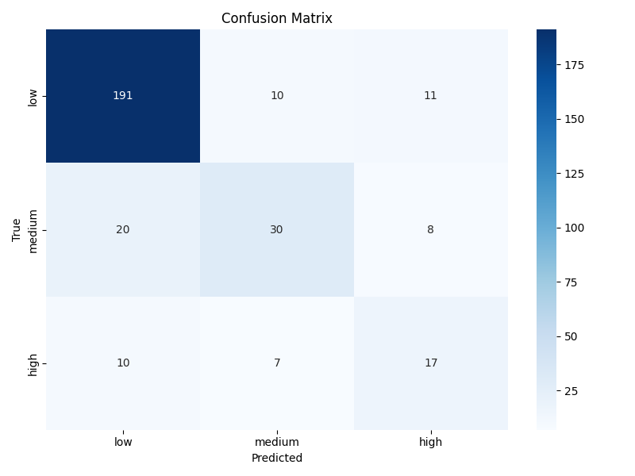

# Tennis Shot Height Classifier

A machine learning system that predicts tennis shot height categories based on ball bounce data. The project is part of the Statistical Methods in AI (SMAI) course.

## Project Overview

This project implements a neural network classifier that categorizes tennis shots into three height categories:
- **Low**: Shots that stay close to the net height
- **Medium**: Shots that reach a moderate height
- **High**: Shots that reach a significant height above the net

The system analyzes ball trajectory data from tennis match videos, extracts features related to ball bounce and velocity, and uses these features to predict the height category of each shot.

## Repository Structure

- `train.py`: Trains the neural network model on the dataset
- `inference.py`: Runs inference using a trained model on new data/videos
- `generate_dataset.py`: Processes raw data from match videos to create the training dataset
- `merge_csv.py`: Utility script to merge multiple CSV files
- `dataset.csv`: The dataset used for training the model
- `height_net_best.pt`: The trained model weights
- `confusion_matrix.png`: Visual representation of model performance
- `results.txt`: Detailed evaluation metrics
- `data/`: Directory containing raw data from 5 tennis matches

## Features

- Perspective transformation to map court coordinates
- Velocity calculation from ball trajectories
- Height categorization based on ball position relative to virtual height lines
- Neural network for shot height classification
- Video visualization with real-time height category display

## Model Architecture

The model (`HeightNet`) is a simple feedforward neural network with the following architecture:
- Input layer (4 features): velocity before bounce (x,y), bounce position (x,y)
- Hidden layer 1: 64 neurons with ReLU activation and batch normalization
- Hidden layer 2: 32 neurons with ReLU activation
- Output layer: 3 neurons (one for each height category)

## Installation Requirements

```
pip install torch numpy pandas scikit-learn opencv-python tqdm matplotlib seaborn
```

## Usage

### Training the Model

```bash
python train.py
```

This will train the model on the dataset.csv file and save the best model weights to height_net_best.pt.

### Generating a Dataset

```bash
python generate_dataset.py --corners data/game_1/corners.json --ball_markup data/game_1/ball_markup.json --event_markup data/game_1/events_markup.json --output game_1_data.csv
```

You can then merge multiple game datasets:

```bash
python merge_csv.py --input game_1_data.csv game_2_data.csv game_3_data.csv --output dataset.csv
```

### Running Inference

To analyze videos and display shot height categories:

```bash
python inference.py data/game_1/data.csv path_to_video.mp4 data/game_1/corners.json --output annotated_video.mp4
```

## Model Performance

The model achieves good accuracy across all three height categories. The confusion matrix visualization shows the classification results:


**Classification Report:**
```console
Classification Report:
              precision    recall  f1-score   support

         low       0.97      0.95      0.96       150
      medium       0.73      0.83      0.77        58
        high       0.82      0.78      0.80        96

    accuracy                           0.87       304
   macro avg       0.84      0.85      0.84       304
weighted avg       0.88      0.87      0.87       304
```


## Data Collection

The data is collected from tennis match videos using the following process:
1. Mark court corners for perspective transformation
2. Ball positions for each frame from OpenTTGames dataset
3. Bounce events for each frame from OpenTTGames dataset
4. Calculate velocities and transform positions
5. Determine height categories based on trajectory analysis

## Future Improvements

- Real-time ball tracking and height prediction
- Integration with automated video analysis systems
- Classification of additional shot attributes (spin, power, etc.)
- Mobile app for on-court training feedback